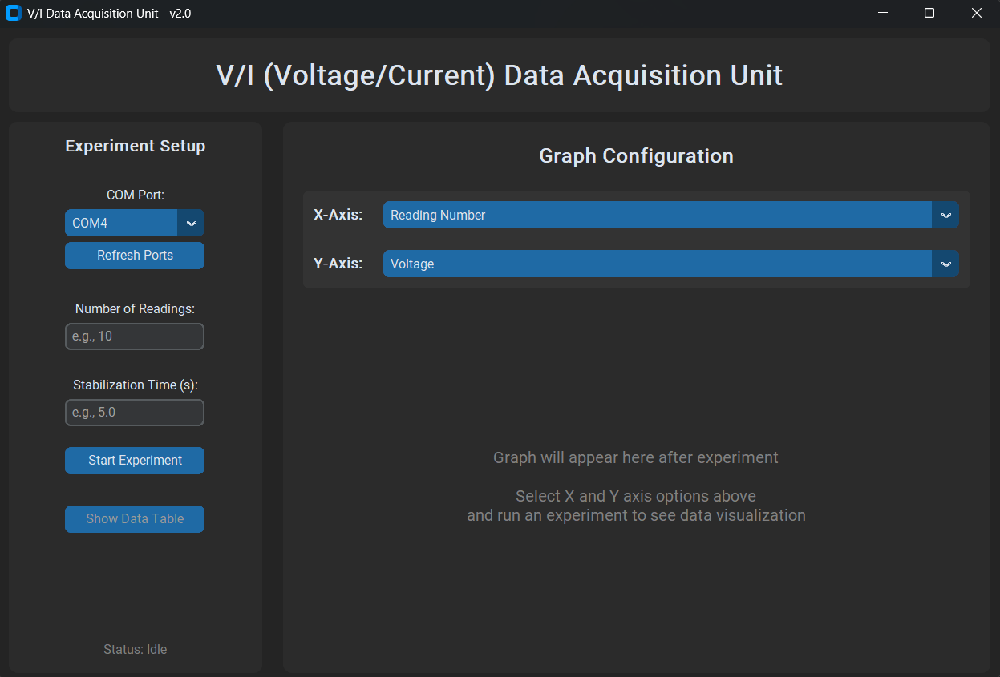

# Automated Monitoring and Data Acquisition Product for Electrical Machines (In Progress – 6-Month Timeline)

Developing a product for automated monitoring and data acquisition of DC/AC electrical machines. The product integrates precision sensors with microcontrollers to measure voltage, current, and power in real time. A Python-based GUI is being designed to visualize and analyze machine performance, enabling advanced control and predictive insights.

My Role: Focused on integrating hardware with software, developing the control logic, and ensuring accurate calibration.

Product Outcome (Expected): A robust solution capable of supporting predictive maintenance, improving machine efficiency, and providing scalable deployment for industrial use.

### Machine Lab

  

---

## ⚙️ Key Features

- **Real-Time Data Acquisition:** The system's hardware utilizes precision sensors for voltage and current measurement. The circuit diagrams below illustrate the sensor setup and how they interface with the microcontroller.

  ### Voltage Divider Circuit
  

    
  

  ### Voltage and Current Circuit
  

    
  

- **Hardware-Software Integration:** The core of the project lies in the seamless integration of a physical sensor setup with a robust software interface. My role involved developing the communication protocols and control logic to ensure reliable data flow from the hardware to the software.

- **Automated Calibration:** The current sensor's zero-current offset is automatically calibrated during startup to guarantee the accuracy of all subsequent current measurements.

- **Python-Based GUI:** A custom graphical user interface (GUI) was developed using **CustomTkinter** and **Matplotlib**. This application provides a user-friendly way to visualize real-time and historical data.

  ### GUI for Data Acquisition
  

    
  

- **Predictive Maintenance & Performance Analysis:** By continuously logging and analyzing voltage and current data, the system provides the foundation for **predictive insights**. This allows for the detection of performance degradation and the early identification of potential failures, ultimately improving machine efficiency and reducing downtime.

---

## 🛠️ My Role and Contributions

My focus was on the **hardware-software interface** and **control logic**. I was responsible for:

- **Developing the Arduino Sketch:** I wrote the microcontroller code to accurately read from the voltage and current sensors, perform necessary calculations, and format the data for serial transmission.
- **Designing the Python GUI:** I built the desktop application to handle serial communication, parse incoming data, and present it in a clear, interactive format.
- **Ensuring System Robustness:** I implemented multi-threading to prevent the GUI from freezing during data acquisition and added error handling to manage serial communication failures.
- **Data Handling:** I created the functionality to store, plot, and display the collected data, providing users with a complete view of the experiment's results.
